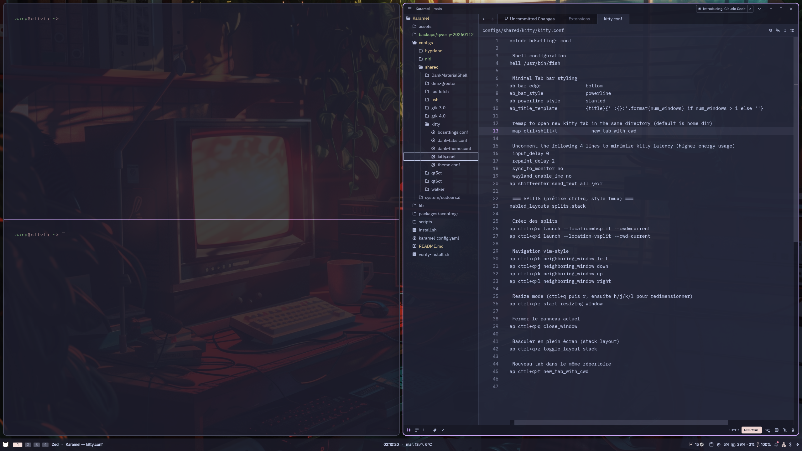

# Karamel-Config

**Karamel Desktop** for Hyprland & Niri with DankMaterialShell

A complete, ready-to-use desktop environment configuration for Arch Linux featuring modern Wayland compositors with Catppuccin aesthetics and Karamel branding.

> Fork personnalisé de [BD-Configs](https://gitlab.com/theblackdon/karamel) par TheBlackDon

## Features

- **Dual Compositor Support**: Choose between Hyprland (dynamic tiling) or Niri (scrollable tiling), or install both
- **DankMaterialShell (DMS)**: Beautiful Material Design shell with bar, notifications, launcher, and lock screen
- **Catppuccin Mocha Theme**: Consistent theming across all applications (GTK, Qt, terminal, shell)
- **Karamel Branding**: Custom pixel art cat logo and ASCII art for fastfetch
- **Yaru-sage Icons**: Fresh green icon theme for a natural look
- **DMS-Greeter**: Elegant display manager for seamless session switching
- **Karamel Plymouth Theme**: Tiger-stripe logo boot splash
- **Walker Keybindings Menu**: Search all keybindings with `Super + :`
- **Curated Applications**: kitty terminal, fish shell, nemo file manager, and optional apps
- **Symlinked Configs**: Easy to update - edit files in the repo and changes apply immediately
- **aconfmgr Integration**: Declarative package management for tracking your system configuration

## Screenshots


*Karamel running with Niri, DankMaterialShell, and Catppuccin Mocha theme*

## Requirements

- **OS**: Arch Linux or Arch-based distribution (CachyOS, EndeavourOS, etc.)
- **AUR Helper**: paru or yay
- **Internet Connection**: Required for package installation

## Installation

### Quick Install

```bash
git clone <your-repo-url>
cd karamel-config
./install.sh
```

The installer will guide you through:
1. System compatibility checks
2. Compositor selection (Hyprland, Niri, or both)
3. Optional application selection
4. Plymouth boot theme (optional)
5. Package installation
6. Configuration deployment
7. Theme application
8. Display manager setup
9. Plymouth theme installation (if selected)

### What Gets Installed

**Base System:**
- Linux kernel, firmware, AMD microcode
- Build tools (git, cmake, meson, gcc, base-devel)
- LVM2 for LUKS encryption support

**Wayland Desktop:**
- Hyprland & Niri compositors
- DankMaterialShell (dms-shell-git) + Quickshell
- XDG desktop portals
- Screenshot tools (grim, slurp, satty)
- Clipboard management (wl-clipboard, cliphist)
- Plymouth boot splash

**Audio & Connectivity:**
- PipeWire audio (pipewire-pulse, wireplumber)
- Bluetooth (bluez, bluez-utils)
- NetworkManager

**Power Management (Framework 16):**
- fw-ectool-git (battery sustainer control)
- auto-cpufreq (CPU frequency management)

**Theme Packages:**
- Catppuccin GTK theme (Mocha variant)
- Yaru-sage icon theme
- Bibata Modern Ice cursor
- Qt5/Qt6 Wayland support + Kvantum
- Nerd Fonts (FiraCode, symbols)

**Terminal & Editors:**
- kitty (terminal emulator)
- fish (shell)
- helix, zed, vim (editors)
- walker (application launcher)
- yazi (terminal file manager)

**Applications:**
- nemo (file manager)
- fastfetch (system info)
- zen-browser-bin (optional)
- whatsapp-for-linux-git (optional)

## Post-Installation

### First Login

1. **Reboot your system**
2. **At the DMS-greeter login screen:**
   - Select your preferred session (Hyprland or Niri)
   - Log in with your credentials
3. **Enjoy your Karamel desktop!**

### Customizing Colors (Recommended)

After first boot, customize your accent color via DMS:
1. Right-click on the bar → **Settings**
2. Go to **Theme** section
3. Choose a wallpaper with warm tones (peach/orange recommended with Yaru-sage icons)
4. Matugen will automatically generate harmonious colors

**Recommended accent**: Catppuccin **Peach** (#fab387) - complements Yaru-sage icons beautifully

### Key Bindings

#### Universal (Both Compositors)
- `Super + Space` - Application launcher (with Karamel cat logo)
- `Super + T` or `Super + Return` - Terminal (kitty)
- `Super + Ctrl + Return` - Floating Terminal (kitty)
- `Super + Q` - Close window
- `Super + F` - File manager (nemo)
- `Super + B` - Browser (if installed)
- `Super + :` - Keybindings menu (Walker)
- `Super + Shift + R` - Reload compositor config
- `Ctrl + Alt + L` - Lock screen
- `Super + Ctrl + Up or Down` - Move relative workspaces

#### Media Keys
- `XF86AudioRaiseVolume` - Volume up
- `XF86AudioLowerVolume` - Volume down
- `XF86AudioMute` - Toggle mute
- `XF86MonBrightnessUp` - Brightness up
- `XF86MonBrightnessDown` - Brightness down


## Walker Keybindings Menu

Press `Super + :` (colon) to open a searchable menu of all keybindings for your current compositor. The menu is styled with Catppuccin Mocha colors and shows keybindings in "key → action" format.

The menu dynamically parses your compositor's config files:
- Hyprland: `configs/hyprland/hypr/keybinds-*.conf`
- Niri: `configs/niri/niri/binds.kdl`

## Plymouth Boot Theme

Karamel includes a custom Plymouth boot splash theme featuring the "KARAMEL" logo with tiger-stripe colors inspired by the Karamel cat mascot.

### Colors
- Orange clair/beige: `#e8c8a0`
- Orange: `#d4a574`
- Orange foncé: `#c87830`
- Marron: `#8b5a2b`
- Background: Catppuccin Mocha base `#1e1e2e`

### Manual Installation
If you didn't enable Plymouth during installation:
```bash
# Copy theme to system
sudo cp -r ~/Karamel/assets/plymouth /usr/share/plymouth/themes/karamel

# Set as default theme
sudo plymouth-set-default-theme karamel

# Regenerate initramfs
sudo mkinitcpio -P
```

### Prerequisites
Ensure Plymouth is installed and configured in mkinitcpio:
```bash
# Install Plymouth
sudo pacman -S plymouth

# Add 'plymouth' to HOOKS in /etc/mkinitcpio.conf
# Example: HOOKS=(base udev plymouth autodetect modconf ...)
```

## Package Management with aconfmgr

Karamel uses **aconfmgr** for declarative package management. All packages are organized in `~/.config/aconfmgr/` with categorized `.sh` files.

### Package Categories

| File | Description |
|------|-------------|
| `10-base.sh` | Base system (kernel, firmware, lvm2) |
| `20-desktop.sh` | Wayland compositors (Hyprland, Niri, DMS, XDG portals) |
| `30-audio-bluetooth.sh` | PipeWire audio, Bluetooth, NetworkManager |
| `35-power.sh` | Power management (fw-ectool, auto-cpufreq) |
| `40-terminal-shell.sh` | Terminal (kitty, fish, helix, zed, walker) |
| `50-themes.sh` | GTK/Qt themes, fonts, cursors, icons |
| `60-dev.sh` | Development tools (git, cmake, yay) |
| `70-apps.sh` | Applications (zen-browser, fastfetch) |
| `90-temporaire.sh` | Temporary packages |

### Using aconfmgr

```bash
# See what packages would be installed/removed
aconfmgr diff

# Apply configuration (install/remove packages)
aconfmgr apply

# Save current system state to config
aconfmgr save
```

### Adding New Packages

1. Install the package: `yay -S package-name`
2. Add to the appropriate `.sh` file:
   ```bash
   AddPackage package-name  # Description
   # or for AUR packages:
   AddPackage --foreign package-name  # Description
   ```
3. Run `aconfmgr apply` to verify

### Fish Shell Integration

The fish config includes helpful reminders when using `pacman` or `yay`:
- Reminds you to add packages to aconfmgr
- Shows which file to edit based on package category

## Power Management (Framework 16)

Karamel includes power management optimized for Framework Laptop 16.

### kpower Command

```bash
kpower status    # Show current battery, profile, and sustainer status
kpower chill     # 40-60% battery, low-power profile
kpower notso     # 60-80% battery, balanced profile
kpower furious   # 0-100% battery, performance profile
```

### Power Modes

| Mode | Battery Range | CPU Profile | Use Case |
|------|---------------|-------------|----------|
| `chill` | 40-60% | low-power | Battery longevity, light tasks |
| `notso` | 60-80% | balanced | Daily use, moderate workloads |
| `furious` | 0-100% | performance | Gaming, heavy compilation |

### Auto-Switch Daemon

The `karamel-power.service` automatically switches modes based on CPU/GPU load when on AC power:
- Load < 30% → chill
- Load 30-70% → notso
- Load > 70% → furious

```bash
# Enable the daemon
systemctl --user enable --now karamel-power

# Check status
systemctl --user status karamel-power
```

## Fish Shell Functions

### Karamel Functions

| Function | Description |
|----------|-------------|
| `kpower` | Power management (see above) |
| `kreload` | Reload compositor config and regenerate keybinds |
| `kbinds` | Show keybinds in terminal |
| `kbinds -w` | Show keybinds in Walker launcher |

### File Navigation (fzf)

| Function | Description |
|----------|-------------|
| `ffcd` | Fuzzy find and cd to directory |
| `ffch` | Fuzzy search command history |
| `ffe` | Find file and open in editor |
| `ffec` | Search file contents and open |

## Customization

All configuration files are symlinked from the repository, making customization easy:

```bash
cd karamel-config

# Edit compositor configs
nano configs/hyprland/hypr/hyprland.conf
nano configs/niri/niri/config.kdl

# Edit terminal config
nano configs/shared/kitty/kitty.conf

# Edit shell config
nano configs/shared/fish/config.fish

# Edit DMS settings
nano configs/shared/DankMaterialShell/settings.json

# Edit fastfetch (Karamel cat ASCII)
nano configs/shared/fastfetch/config.jsonc
```

Changes take effect immediately (or after reloading the compositor with `Super+Shift+R`).

### Changing Wallpapers

Replace the wallpaper at:
```bash
assets/wallpapers/wallpaper.png
```

Or edit the compositor config to point to your own wallpaper.

### Karamel Assets

Custom branding assets are located in `assets/`:
- `karamel-cat.txt` - ASCII art cat for fastfetch
- `karamel-logo.png` - Pixel art cat for DMS launcher

## Troubleshooting

### DMS-greeter doesn't start
```bash
# Check greetd status
sudo systemctl status greetd

# Check greetd config
cat /etc/greetd/config.toml

# Restart greetd
sudo systemctl restart greetd
```

### Themes not applying
```bash
# Reapply themes manually
gsettings set org.gnome.desktop.interface gtk-theme 'catppuccin-mocha-mauve-standard+default'
gsettings set org.gnome.desktop.interface icon-theme 'Yaru-sage'
gsettings set org.gnome.desktop.interface cursor-theme 'Bibata-Modern-Ice'
```

### DMS shell not starting
```bash
# Check if DMS is running
pgrep -a dms

# Start DMS manually
dms run
```

### Compositor won't start
```bash
# For Hyprland
Hyprland

# For Niri
niri-session

# Check logs
journalctl --user -xe
```

### Fastfetch not showing cat
```bash
# Test fastfetch
fastfetch

# Check if ASCII file exists
cat ~/.config/karamel/assets/karamel-cat.txt
```

## Uninstallation

To remove karamel-config and restore your system:

```bash
# Stop and disable greetd
sudo systemctl disable --now greetd

# Restore original configs (if you made a backup)
rm -rf ~/.config
mv ~/.config.backup-YYYYMMDD_HHMMSS ~/.config

# Remove symlinks
unlink ~/.config/hypr
unlink ~/.config/niri
unlink ~/.config/DankMaterialShell
# ... etc

# Optionally remove packages
sudo pacman -R hyprland niri dms-shell-git greetd-dms-greeter-git
```

## Directory Structure

```
Karamel/
├── install.sh              # Main installer script
├── verify-install.sh       # Post-installation verification
├── README.md               # This file
├── karamel-config.yaml     # Configuration manifest
├── lib/                    # Installer library functions
│   ├── utils.sh           # Utility functions
│   ├── checks.sh          # System checks
│   ├── packages.sh        # Package installation (aconfmgr format)
│   ├── dotfiles.sh        # Config deployment
│   ├── themes.sh          # Theme application
│   ├── greeter.sh         # Display manager setup
│   └── plymouth.sh        # Plymouth boot theme setup
├── packages/               # Package definitions (aconfmgr format)
│   └── aconfmgr/          # Categorized package files
│       ├── 10-base.sh
│       ├── 20-desktop.sh
│       ├── 30-audio-bluetooth.sh
│       ├── 35-power.sh
│       ├── 40-terminal-shell.sh
│       ├── 50-themes.sh
│       ├── 60-dev.sh
│       ├── 70-apps.sh
│       └── 90-temporaire.sh
├── configs/               # Configuration files
│   ├── shared/            # Shared between compositors
│   │   ├── fish/          # Fish shell config
│   │   ├── kitty/         # Kitty terminal config
│   │   ├── fastfetch/     # Fastfetch with Karamel cat
│   │   ├── walker/        # Walker launcher config
│   │   └── DankMaterialShell/  # DMS settings
│   ├── hyprland/          # Hyprland-specific
│   │   └── hypr/          # Hyprland config files
│   └── niri/              # Niri-specific
│       └── niri/          # Niri config files
├── scripts/               # Helper scripts
│   ├── keybinds.sh        # Walker keybindings menu
│   ├── karamel-keybinds.sh # Keybinds parser
│   ├── karamel-power-daemon.sh # Auto-switch power daemon
│   └── screenshot.sh      # Screenshot utility
└── assets/                # Wallpapers, Karamel branding
    ├── karamel-cat.txt    # ASCII art for fastfetch
    ├── karamel-logo.png   # Pixel art cat for launcher
    ├── plymouth/          # Plymouth boot theme
    │   ├── karamel.plymouth
    │   ├── karamel.script
    │   ├── logo.png       # Tiger-stripe KARAMEL logo
    │   └── *.png          # Progress bar and dialog assets
    └── wallpapers/        # Desktop wallpapers
```

## Credits

- **[BD-Configs](https://gitlab.com/theblackdon/karamel)** - Original dotfiles by TheBlackDon
- **[Karamel](https://github.com/...)** - Pixel art assets and branding
- **[DankMaterialShell (DMS)](https://github.com/dburian/DankMaterialShell)** - Beautiful Material Design shell for Wayland
- **[Hyprland](https://hyprland.org/)** - Dynamic tiling Wayland compositor
- **[Niri](https://github.com/YaLTeR/niri)** - Scrollable-tiling Wayland compositor
- **[Catppuccin](https://github.com/catppuccin/catppuccin)** - Soothing pastel theme
- **[Yaru](https://github.com/ubuntu/yaru)** - Icon theme
- **[greetd](https://git.sr.ht/~kennylevinsen/greetd)** - Minimal display manager

## License

MIT License - Feel free to use and modify as you wish!

---

**Karamel Desktop** - A cozy, personalized Arch Linux experience 🐱
